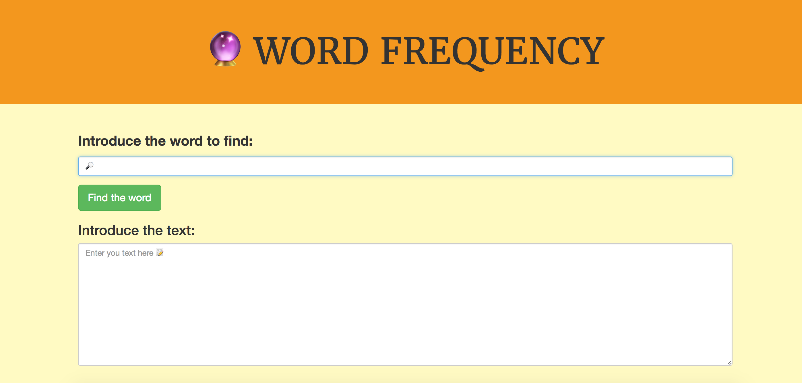

# _Word Frequency_		

https://wordfrequencyapp.herokuapp.com/		

#### _Website in Silex that returns how frequently a word appears in a given string._		
#### _By Félix Oporto_		

## Description		

_Web app that return how frequently a word appears in a given string. This website has been created as a project for the second week of php at Epicodus. It serves as a demonstration of the use of Behavior-driven development(BDD) and Red-Green-Refactor._		

# 

&nbsp;
## Specifications

|Behavior|Input 1 // Input 2|Output|
|--------|-----|------|
| User leave form empty. Program output an alert.  | "" // "" | "You need to fill all the blanks." |
| Program compare that two words are spelled the same. | "fear" // "fear" | 1 |
| Program compare that two words are not spelled the same.  | "fear" // "crocodile" | 0 |
| Program compare two words that have different cases.  | "fear" // "Fear" | 1 |
| Program compare one word with a string of words. | "fear" // "The only thing we should fear is fear itself" | 2 |
| Program compare one word with a string of words that have special characters | "fear" // "The only thing we should fear, is fear 'itself'." | 2 |
| Program compare one word with special characters with a string of words | "fear !?" // "The only thing we should fear is fear itself" | 2 | 	

## Setup/Installation Requirements		

* _Clone this repository._		
* _Check that you have composer installed (https://getcomposer.org/)_		
* _Run "composer install" from the project directory in terminal. This will install the required dependencies (Silex and Twig) in the project directory._		
* _Open terminal and navigate to the folder "web", inside of this folder you need to set up  a server by typing php -S localhost:8000._		
* _Go to your browser and type http://www.localhost8000/._		

## Known Bugs		

_No known bugs._		

## Support and contact details		

Please direct questions  to the author:		
* felixop8@gmail.com		

## Technologies Used		
- html		
- css		
- bootstrap		
- php		
- composer		
- silex		
- twig		
- Heroku		

## License		
MIT Commons		
Copyright (c) 2017 Felix Oporto Lopez.
